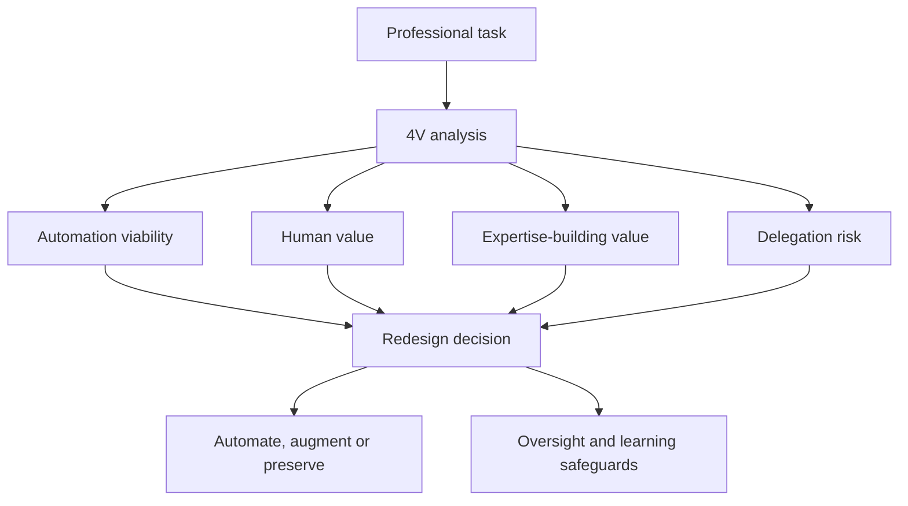

# Professional Role Redesign in the Age of Generative AI

**A framework for identifying automation, augmentation and distinctive human value**

This repository contains the public edition of my Master's Thesis in Artificial Intelligence and Innovation, completed in August 2026.

The original academic title is:

> *Rediseño de puestos profesionales ante la adopción de IA generativa: un modelo para identificar automatización, aumento y valor humano diferencial.*

## The question behind the research

When generative AI automates part of a professional role, organisations need to decide more than what is technically possible. They also need to determine:

- which tasks should be automated;
- which tasks should be augmented rather than delegated;
- which human capabilities and forms of judgement need to be preserved;
- which tasks help less experienced professionals build expertise;
- and how work, oversight and learning pathways should be redesigned.

The thesis argues that evaluating AI only through short-term productivity can overlook the developmental role of work. Some apparently routine tasks help professionals acquire contextual understanding, pattern recognition, judgement, autonomy and the ability to supervise future outputs.

## The 4V model

The thesis proposes a task-level framework comprising four analytical dimensions:

| Dimension | Original term | Central question |
|---|---|---|
| **Automation Viability (VA)** | Viabilidad de Automatización | To what extent can AI perform the task reliably in its real context? |
| **Differential Human Value (VHD)** | Valor Humano Diferencial | What value still depends on human judgement, context, relationships or accountability? |
| **Expertise-Building Value (VCE)** | Valor de Construcción de Expertise | How much does performing the task contribute to professional learning and judgement? |
| **Delegation Risk (RD)** | Riesgo de Delegación | What could be lost or harmed if the task were delegated to AI? |

The model also introduces the concept of **Critical Development Experience (ECD)** to identify the elements of a task that contribute materially to professional development.

## Exploratory application

The framework is applied exploratorily to 15 tasks within the Project Manager role. The thesis examines three areas in greater depth:

1. status reporting;
2. risk management;
3. issue and exception management.

The analysis suggests that a task may have both high automation viability and high expertise-building value. These tasks require particular care: automating them may improve immediate efficiency while weakening the pathway through which professionals learn to exercise judgement.

## Main contribution

The central proposal is not to preserve tasks by default or automate them by default. It is to redesign human-AI collaboration deliberately, including:

- allocation of work between people and AI;
- human oversight and accountability;
- verification and escalation mechanisms;
- preservation of critical knowledge;
- replacement learning experiences when developmental tasks disappear;
- and Responsible AI safeguards.

## Methodological status and limitations

This is a theoretical and applied Master's Thesis. The 4V model and its application to the Project Manager role are exploratory and do **not** constitute empirical validation.

Future validation should include interviews, surveys, expert review and application in real organisational settings.

## Repository contents

- [`thesis/Coro_Hernando_de_Larramendi_AI_Job_Redesign_TFM_2026.pdf`](thesis/Coro_Hernando_de_Larramendi_AI_Job_Redesign_TFM_2026.pdf): public edition of the complete thesis.
- [`CITATION.cff`](CITATION.cff): citation metadata.
- [`NOTICE.md`](NOTICE.md): authorship and reuse notice.

## Citation

Hernando de Larramendi Varela, C. (2026). *Professional Role Redesign in the Age of Generative AI: A Framework for Identifying Automation, Augmentation and Distinctive Human Value*. Master's Thesis, Artificial Intelligence and Innovation, Founderz.

## Author

**Coro Hernando de Larramendi**

My current work focuses on AI workforce transition, job redesign, expertise, reskilling and the pathways through which professionals develop judgement in AI-enabled organisations.

- [LinkedIn](https://www.linkedin.com/in/corohlarramendi/)
- [GitHub](https://github.com/chlarramendiVARELA)

## Language

The thesis is written in Spanish and includes an abstract in English. This README provides an English-language overview for international readers.

## Disclaimer

This work represents the author's independent analysis. References to Founderz describe the academic programme in which the thesis was completed and do not imply institutional endorsement of the framework or conclusions.

